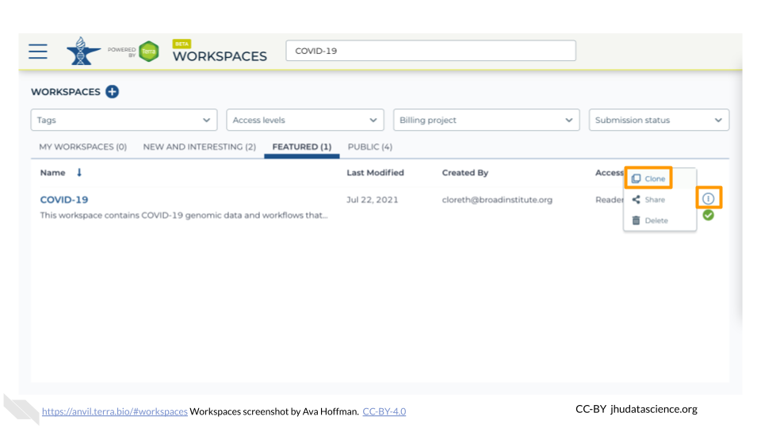
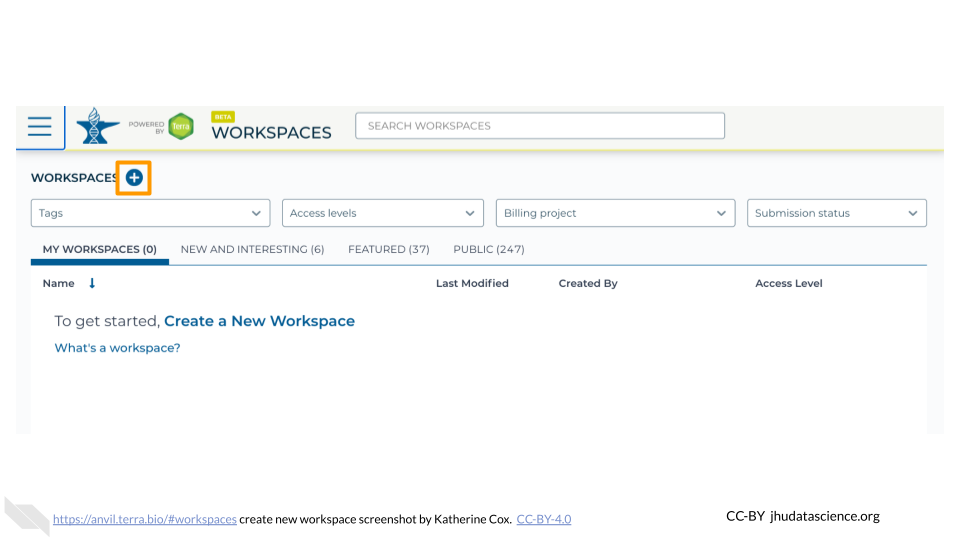
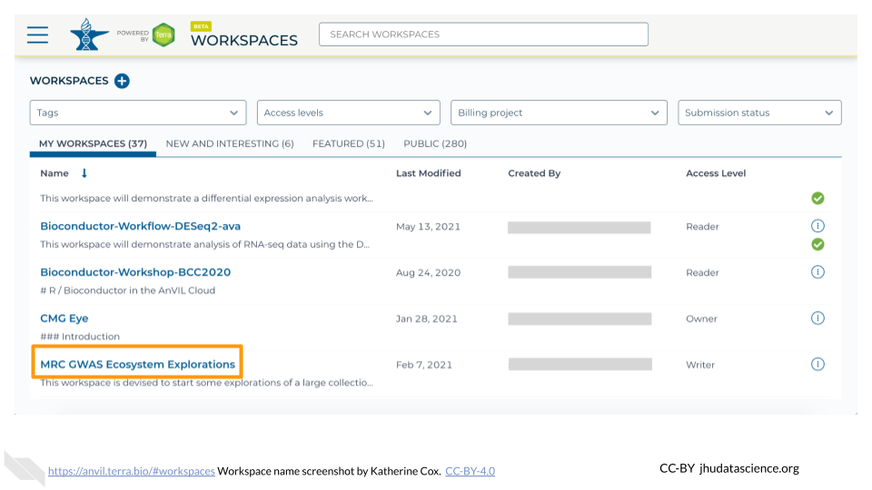

# (PART\*) AnVIL Modules {-}

# Workspaces

Modules about Terra Workspaces

 

## Clone a Workspace

1. [Launch Terra](https://anvil.terra.bio/#workspaces)

1. Locate the Workspace you want to clone. If a Workspace has been shared with you ahead of time, it will appear in "MY WORKSPACES". You can clone a Workspace that was shared with you to perform your own analyses. In the screenshot below, no Workspaces have been shared.

    

1. If a Workspace hasn't been shared with you, navigate to the "FEATURED" or "PUBLIC" Workspace tabs.

    
    
1. Use the search box to find the Workspace you want to clone.

    
    
1. Click the teardrop button on the far right next to the Workspace you want to clone. Click "Clone". You can also clone the Workspace from the Workspace Dashboard instead of the search results.

    
    
    
1. You will see a popup box appear. Name your Workspace and select the appropriate Terra Billing Project.  **All activity in the Workspace will be charged to this Billing Project** (regardless of who conducted it). Remember that each Workspace should have its own Billing Project.

    

1. If you are working with protected data, you can set the **Authorization Domain** to limit who can be added to your Workspace.  Note that the Authorization Domain cannot be changed after the Workspace is created (i.e. there is no way to make this Workspace shareable with a larger audience in the future).  Workspaces by default are only visible to people you specifically share them with.  Authorization domains add an extra layer of enforcement over privacy, but by nature make sharing more complicated.  We recommend using Authorization Domains in cases where it is extremely important and/or legally required that the data be kept private (e.g. protected patient data, industry data).  For data you would merely prefer not be shared with the world, we recommend relying on standard Workspace sharing permissions rather than Authorization Domains, as Authorization Domains can make future collaborations, publications, or other sharing complicated.

    
    
1. Click "CLONE WORKSPACE".  The new Workspace should now show up under your Workspaces.

    

## Create a Workspace

1. [Launch Terra](https://anvil.terra.bio/#workspaces)

1. In the drop-down menu on the left, navigate to "Workspaces". Click the triple bar in the top left corner to access the menu. Click "Workspaces".

    

1. Click on the **plus icon** near the top of left of the page.

    

1. Name your Workspace and select the appropriate Billing Project.  **All activity in the Workspace will be charged to this Billing Project** (regardless of who conducted it).

    

1. If you are working with protected data, you can set the **Authorization Domain** to limit who can be added to your Workspace.  Note that the Authorization Domain cannot be changed after the Workspace is created (i.e. there is no way to make this Workspace shareable with a larger audience in the future).  Workspaces by default are only visible to people you specifically share them with.  Authorization domains add an extra layer of enforcement over privacy, but by nature make sharing more complicated.  We recommend using Authorization Domains in cases where it is extremely important and/or legally required that the data be kept private (e.g. protected patient data, industry data).  For data you would merely prefer not be shared with the world, we recommend relying on standard Workspace sharing permissions rather than Authorization Domains, as Authorization Domains can make future collaborations, publications, or other sharing complicated.

    

1. Click "CREATE WORKSPACE".  The new Workspace should now show up under your Workspaces.

    

## Open a Workspace

1. [Launch Terra](https://anvil.terra.bio/#workspaces)

1. In the drop-down menu on the left, navigate to "Workspaces". Click the triple bar in the top left corner to access the menu. Click "Workspaces".

    

1. You are automatically directed to the "My Workspaces" tab.  Here you can see any Workspaces that have been shared with you, along with your permission level.

    
   
    - **Reader** means you can open the Workspace and see everything, but can't do any computations or make any edits.
    - **Writer** means you can run computations, which will charge costs to the Workspace's Billing Project.  Writers can also make edits to the Workspace.
    - **Owner** is similar to Writer, but also allows you to control who can access the Workspace.
    
1. Click on the name of a Workspace to open it.  Opening and viewing a Workspace does not cost anything.

    

1. When you open a Workspace, you are directed to the Workspace Dashboard.  This generally has a description of the Workspace contents, as well as some useful details about the Workspace itself.

    

From here you can navigate through the different tabs of the Workspace, and if you have sufficient permission, you can start running analyses.  If you are only a Reader, you may need to "clone" (make your own copy) of the Workspace before you can start working.

## Share a Workspace

1. [Launch Terra](https://anvil.terra.bio/#workspaces)

1. In the drop-down menu on the left, navigate to "Workspaces". Click the triple bar in the top left corner to access the menu. Click "Workspaces".

    

1. Click on the name of the Workspace to open the Workspace. Opening a Workspace does not cost anything.  Certain activities in the Workspace (such as running an analysis) will charge to the Workspace’s Billing Project.  Workspace management (e.g. adding and removing members, editing the description) does not cost money.

    

1. Click the circle with 3 dots on the right hand side to open the Workspace management menu.  Click "Share"

    

1. Enter the email address of the user you want to share the Workspace with.  This must be the address associated with the account they are using to access Terra.

    

1. Choose their permission level.

    - Remember that all activity in the Workspace will be charged to the Workspace's Billing Project, regardless of who conducts it, so only add members as "Writers" or "Owners" if they should be charging to the Workspace's Billing Project.
    - "Readers" can view all parts of the Workspace but cannot make edits or run analyses (i.e. they cannot spend money).  They can also clone their own copy of the Workspace where they can conduct activity on their own Billing Project.

    

1. Click "Save".  The user should now be able to see the Workspace when logged in to Terra.

    

