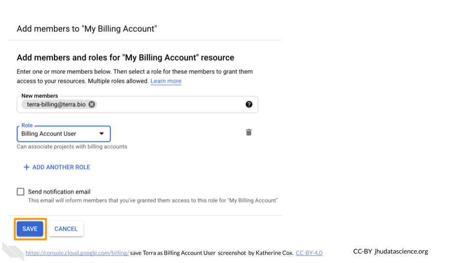
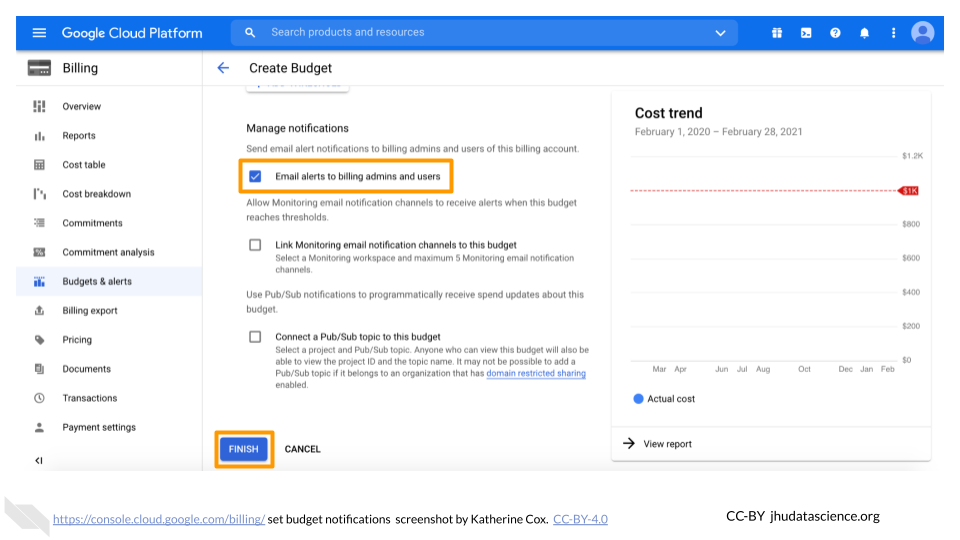
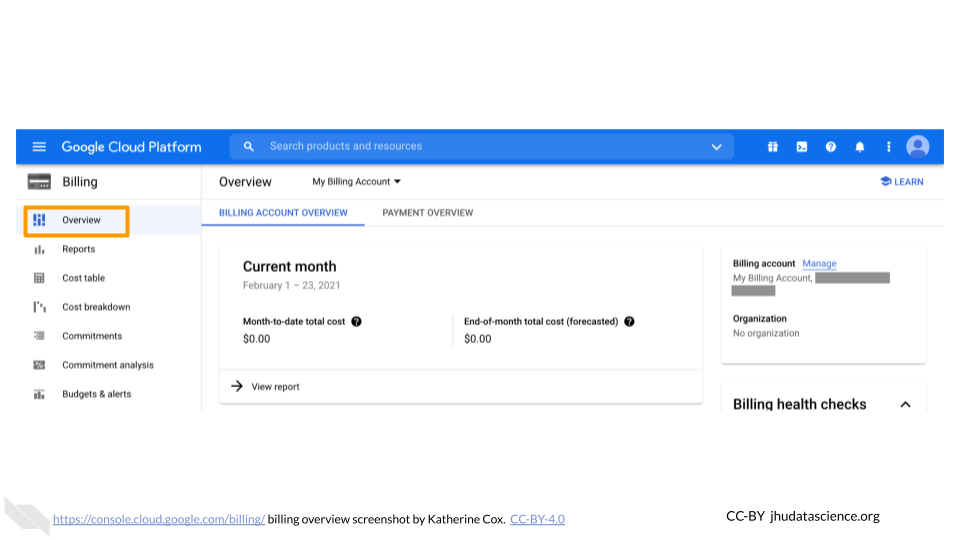

# Billing

Modules about billing and Billing Projects on Google Cloud Platform and Terra.

 

## Create Google Billing Account

1. Log in to the [Google Cloud Platform](https://console.cloud.google.com/) console using your Google ID. **Make sure to use the same Google account ID you use to log into Terra.**  

1. If you are a first time user, don’t forget to claim your free credits! If you haven't been to the console before, once you accept the Terms of Service you will be greeted with an invitation to "Try for Free."

    

1. Follow the instructions to sign up for a Billing Account and get your credits. 

1. Choose “Individual Account”. This “billing account” is just for managing billing, so you don’t need to be able to add your lab members. You will need to give either a credit card or bank account for security. Don't worry! **You won't be billed until you explicitly turn on automatic billing**.

    

1. You can view and edit your new Billing Account, by selecting “Billing” from the left-hand menu, or going direction to the billing console [console.cloud.google.com/billing](https://console.cloud.google.com/billing) 

    

1. Clicking on the Billing Account name will allow you to manage the account, including accessing reports, setting alerts, and managing payments and billing.  We will cover account management in greater detail below.

    

At any point, you can create additional Billing Accounts using the **Create Account** button.  We recommend creating a new Billing Account for each funding source.

## Add Terra to Google Billing Account

This gives Terra permission to create projects and send charges to the Google Billing Account, and must be done by an administrator of the Google Billing Account.

Terra needs to be added as a "Billing Account User":

1. Log in to the [Google Cloud Platform](https://console.cloud.google.com/) console using your Google ID.
1. Navigate to [Billing](https://console.cloud.google.com/billing)

    

1. You may be automatically directed to view a specific Billing Account.  If you see information about a single account rather than a list of your Billing Accounts, you can get back to the list by clicking "Manage Billing Accounts" from the drop-down menu.
 
    

1. Check the box next to the Billing Account you wish to add Terra to, click "ADD MEMBER".

    

1. Enter `terra-billing@terra.bio` in the text box.  In the drop-down menu, mouse over Billing, then choose "**Billing Account User**".

    

1. Click "SAVE".

    

## Create Terra Billing Project

1. [Launch Terra](https://anvil.terra.bio/#workspaces) and sign in with your Google account.  **Make sure to use the same Google account that you used to set up Google Billing.** If this is your first time logging in to Terra, you will need to accept the Terms of Service.

1. In the drop-down menu on the left, navigate to "Billing". Click the triple bar in the top left corner to access the menu. Click the arrow next to your name to expand the menu, then click "Billing".

    

1. On the Billing page, click the "+ CREATE" button to create a new Billing Project. If prompted, select the Google account to use.  Make sure to use the same Google account that you used to set up Google Billing. If prompted, give Terra permission to manage Google Cloud Platform billing accounts.

    

1. Enter a unique name for your Terra Billing Project and select the appropriate Google Billing Account. The name of the Terra Billing Project must:
    + Only contain lowercase letters, numbers and hyphens
    + Start with a lowercase letter
    + Not end with a hyphen
    + Be between 6 and 30 characters
    + Be unique across all Google Billing Projects

    

The page doesn't always update as soon as the billing project is created.  If it's been a couple of minutes and you don't see a change, try refreshing the page.

## Add Members to Google Billing Account

Anyone you wish to add to the Billing Account will need their own Google ID.

To add a member to a Billing Project:
  
1. Log in to the [Google Cloud Platform](https://console.cloud.google.com/) console using your Google ID.
1. Navigate to [Billing](https://console.cloud.google.com/billing)

    

1. You may be automatically directed to view a specific Billing Account.  If you see information about a single account rather than a list of your Billing Accounts, you can get back to the list by clicking "Manage Billing Accounts" from the drop-down menu.

    

1. Check the box next to the Billing Account you wish to add a member to, click "ADD MEMBER".

    

1. Enter their Google ID in the text box. In the drop-down menu, mouse over Billing, then choose the appropriate role.

    

1. Click "SAVE".

    

## Set Alerts for Google Billing

1. Log in to the [Google Cloud Platform](https://console.cloud.google.com/) console using the Google ID associated with your Google Cloud projects.

1. Open the dropdown menu on the top left and click on [Billing](https://console.cloud.google.com/billing).

    

1. You may be automatically directed to view a specific Billing Account. If you see information about a single account (and it’s not the one you’re interested in), you can get back to the list of all your Billing Accounts by clicking "Manage Billing Accounts" from the drop-down menu.

    

1. Click on the name of the Billing Account you want to set alerts for.

    

1. In the left-hand menu, click "Budgets & alerts".
 
    

1. Click the "Create Budget" tab.

    

1. Enter a name for your budget, and then choose which projects you want to monitor. Then click "Next".

    

1. For Budget Type, select "Specified amount". Enter the total budget amount for the month (you will set alerts at different thresholds in the next step). Click "**Next**" (do not click "Finish").

    

1. Enter the threshold amounts where you want to receive an alert. We recommend starting with 50% and 90%. You can set other alerts if you prefer.

    

1. Check the box for "Email alerts to billing admins and users", then click "**Finish**". Now you (as the owner and admin), along with anyone you added with admin or user privileges (e.g. lab managers) will receive alerts when your lab members reach the specified spending thresholds. These emails will be sent to the Gmail accounts associated with the Billing Account.

    

1. You can edit your budgets at any time by going to Billing > Budgets & alerts, and clicking on the name of the budget you want to edit.

    

## View Spend for Google Billing

You can always check your current spend through the Google Billing console, but remember

- There is a reporting delay (~1 day), so you cannot immediately see what an analysis cost
- Costs are reported at the level of Workspaces, so if there are multiple people using a Workspace, you will not be able to determine which of them was responsible for the charges.

The Google Billing console displays information by Billing Account.  To view spending:
  
1. Log in to the [Google Cloud Platform](https://console.cloud.google.com/) console using the Google ID associated with your Google Cloud projects.

1. Open the dropdown menu on the top left and click on [Billing](https://console.cloud.google.com/billing).

    

1. You may be automatically directed to view a specific Billing Account. If you see information about a single account (and it’s not the one you’re interested in), you can get back to the list of all your Billing Accounts by clicking "Manage Billing Accounts" from the drop-down menu.

    

1. Click on the name of the Billing Account for the project you want to view.

    

1. Look at the top of the **Overview** tab to see your month-to-date spending.
    
    

1. Scroll further down the **Overview** tab to show your top projects.
    
    

1. Click on the **Reports** tab to see more detailed information about each of your projects.  This is probably the most useful tab for exploring costs of individual projects over time.

    

1. Click on the **Cost table** tab to obtain a convenient table of spending per project.
    
    

